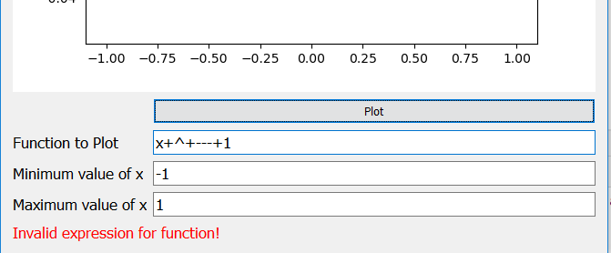

# Function Plotter

A GUI app required by shortlisted applicants for a master micro internship

Made with Python + PyQt5 + Sympy for symbolic math evaluation

## The App
### The GUI

* 1: Canvas where plot is drawn
* 2: Plot button, click to plot the function
* 3: Enter the function to plot here, only accepts numbers, arithmatic operators,
spaces, braces, and 'e'
* 4: Enter the minimum value for x here, only takes integers
* 5: Enter the maximum value for x here, only takes integers
* 6: Message block: shows error and success messages

### How to use

Enter the function in the function text box, and enter minimum and maximum values for x
in their respective text boxes. App will show you errors if you miss any. App also shows errors
if you enter invalid mathematical expressions. 

### Examples of bad inputs
